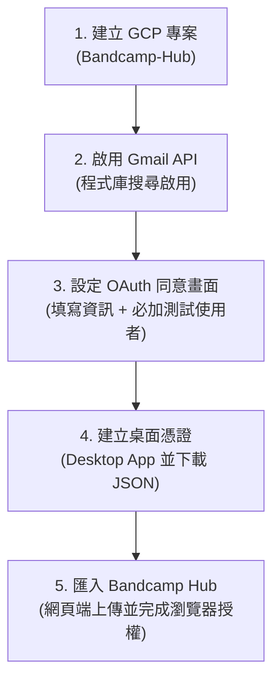

# ⚡ Bandcamp Hub (Studio Pro Edition v2.1.0) - 每週新發行淘歌與 DJ 試聽中心

> **專為音樂重度愛好者、黑膠唱片藏家與 DJ 設計的 Bandcamp 每週新發行自動化檢索與極速試聽中心**。  
> 透過 Gmail API 自動檢索 Bandcamp 官方發行通知郵件，自動提取完整曲目清單與試聽串流，以 ISO 週別時間軸呈現。配備滿版貼底黑膠播放列、DJ 節奏（BPM）分析與變速控制系統、全鍵盤極速流操作，實現零摩擦力的每週淘歌工作流。

---

## 📖 目錄導覽
1. [軟體簡介與核心特色](#1-軟體簡介與核心特色)
2. [系統需求與雙平台快速啟動步驟 (Windows / macOS)](#2-系統需求與雙平台快速啟動步驟-windows--macos)
3. [Google Gmail 憑證申請與授權設定保姆級教學 (圖文指引)](#3-google-gmail-憑證申請與授權設定保姆級教學-圖文指引)
4. [介面功能與 DJ 深度操作手冊](#4-介面功能與-dj-深度操作手冊)
5. [DJ 極速全鍵盤流手冊 (HUD 實時提示)](#5-dj-極速全鍵盤流手冊-hud-實時提示)
6. [常見問題與雙系統疑難排解 (FAQ)](#6-常見問題與雙系統疑難排解-faq)

---

## 1. 軟體簡介與核心特色

**Bandcamp Hub** 是一款**本機優先 (Local-First)** 的專業音樂篩選、試聽與彙整工具。您只需綁定接收 Bandcamp 通知信件的個人的 Gmail 帳號，系統便會自動掃描郵件中的新發行通知，在幾秒鐘內為您整理出結構化、可直接點播的每週音樂清單。

### 🌟 核心亮點一覽：
- 📬 **智慧增量同步與批量調節**：基於時間戳浮水印（Sync Watermark），只查詢最新收到的通知信件，單次可彈性設定處理 20 至 200 封通知，節省頻寬與時間。
- 🎛️ **滿版貼底黑膠動態播放列 (Full-Width Docked Vinyl Player)**：
  - 常駐視窗底部的專業播放列，呈現 33 RPM 黑膠唱盤轉動與唱針聯動動態。
  - **展開式多音軌清單抽屜 (Multi-Track Drawer)**：點擊專輯名稱即可呼叫完整曲目清單，支援單軌直接點播與畫面自動捲動錨定。
  - **單軌試聽履歷淡化 (Audition History Dimming)**：已試聽過的音軌自動以半透明淡出，淘歌進度一覽無遺。
  - **DJ 比例跳轉 Cue 點**：一鍵跳轉至音軌的 `1/3`、`1/2 (中段)`、`2/3` 處，迅速評估編曲架構與精華段落。
  - **精準步進控制**：支援 `⏪ 10s` 倒帶與 `⏩ 10s` 快轉。
- ⚡ **專業 DJ Tempo & BPM 控制套件**：
  - **智慧節奏分析雙引擎**：透過瀏覽器 Web Audio API 自動解碼偵測曲目 BPM，並內建後端音訊代理（`/stream-proxy`）作為跨域兜底保護。
  - **基準節奏 (Base BPM) 微調與手動編輯**：支援 `±2 BPM` 快速步進，並具備 40.0 至 300.0 BPM 嚴格邊界保護。
  - **🥁 Tap Tempo 打拍測速**：支援滑鼠連續點擊或敲擊鍵盤 `T` 鍵即時算拍。
  - **Master Tempo 變速不變調**：提供 ±20%（0.80x ~ 1.20x）速度推桿與 `±1 BPM` 步進，即時計算展示實時節奏（Effective BPM）。
- 📊 **左側 ISO 週別時間軸與進度面板**：依標準 ISO 週別（`YYYY-Www`）自動彙整，即時展示「未聽」與「已聽」比例，支援「一鍵標記本週全聽完」。
- 🎯 **單向晉級狀態機 (One-Way Promotion)**：按下 `S` 標記收藏時，系統自動將作品晉級為「已聽 (Listened)」，大幅減少重複標記的操作負擔。
- 🔒 **本機純隱私運作 (Local-First)**：所有資料庫與憑證僅保存在您的個人電腦上，絕不向外部第三方雲端伺服器傳送隱私資料。

---

## 2. 系統需求與雙平台快速啟動步驟 (Windows / macOS)

### 💻 系統需求
- **作業系統**：Windows 10/11、macOS (12+) 或 Linux
- **Python 環境**：Python 3.10 以上版本（[前往 Python 官方下載頁面](https://www.python.org/downloads/)）

---

### 🪟 Windows 使用者啟動指南

#### 步驟 1：安裝 Python (極重要防呆提醒)
1. 前往 Python 官方網站下載 Windows 安裝檔（Python 3.10 或更新版本）。
2. 執行安裝程式時，在**第一個畫面的最下方，務必勾選「☑ Add python.exe to PATH」**（此步驟確保系統終端機能辨識 python 指令）。
3. 點擊「Install Now」完成安裝。

#### 步驟 2：啟動 Bandcamp Hub (雙軌方式，任選其一)
- **👑 途徑 A：桌面一鍵啟動 (強烈推薦，免打指令)**：
  1. 解壓縮專案資料夾後，直接滑鼠雙擊專案目錄下的 **`start_hub.bat`**。
  2. 系統將自動建立 Python 虛擬環境 (`.venv`) 並安裝所需相依套件。
  3. 安裝完成後，終端機將啟動服務，並自動於您的預設瀏覽器開啟 `http://127.0.0.1:8000`。
- **途徑 B：終端機手動啟動 (PowerShell / CMD)**：
  ```powershell
  # 1. 進入專案根目錄
  cd path\to\bandcamp-hub

  # 2. 建立虛擬環境
  python -m venv .venv

  # 3. 安裝相依套件並啟動
  .\.venv\Scripts\pip install -r requirements.txt
  .\.venv\Scripts\python run.py
  ```

---

### 🍎 macOS 使用者啟動指南

#### 步驟 1：確認 Python 環境
開啟「終端機 (Terminal)」並輸入：
```bash
python3 --version
```
- 若顯示 `Python 3.10.x` 以上即代表環境就緒。
- 若系統尚未安裝，可透過 Homebrew 安裝：`brew install python@3.10`，或前往 Python 官網下載 macOS 安裝包。

#### 步驟 2：啟動 Bandcamp Hub (雙軌方式，任選其一)
- **👑 途徑 A：雙擊桌面指令稿啟動 (`start_hub.command`)**：
  1. 初次使用時，請先開啟「終端機」，進入專案目錄為啟動腳本賦予執行權限：
     ```bash
     chmod +x start_hub.command
     ```
  2. 之後即可直接在 Finder 雙擊 **`start_hub.command`** 啟動！
  > [!TIP]
  > **macOS Gatekeeper 安全性提示解法**：  
  > 若雙擊時系統跳出「無法打開，因為它來自未識別的開發者」：  
  > 請前往 macOS「**系統設定**」>「**隱私權與安全性**」，向下滑動至安全性區塊，點擊「**強制打開 (Open Anyway)**」即可正常執行。

- **途徑 B：終端機手動啟動**：
  ```bash
  # 1. 進入專案目錄
  cd /path/to/bandcamp-hub

  # 2. 建立虛擬環境
  python3 -m venv .venv

  # 3. 安裝相依套件並啟動伺服器
  ./.venv/bin/pip install -r requirements.txt
  ./.venv/bin/python run.py
  ```

---

## 3. Google Gmail 憑證申請與授權設定保姆級教學 (圖文指引)

由於 Google 的資安保護規範，讀取個人的 Gmail 通知信件需要使用者建立屬於自己的**免費個人 Google Cloud 桌面應用程式憑證**。只需設定一次即可永久使用：



---

### 【步驟 1】建立 Google Cloud 專案
1. 開啟瀏覽器前往 [Google Cloud Console](https://console.cloud.google.com/)，登入您的 Google 帳號。
2. 點擊頂部導航列的「**選取專案**」（或目前的專案名稱下拉選單）。
3. 在彈出視窗右上角點擊「**新增專案**」。
4. 專案名稱輸入 `Bandcamp-Hub`，機構留預設「無機構」，點擊「**建立**」。
5. 等待數秒建立完成後，確認頂部專案已切換至剛剛建立的 `Bandcamp-Hub`。

---

### 【步驟 2】啟用 Gmail API
1. 點擊左上角漢堡選單（☰），選擇「**API 和服務**」>「**程式庫 (Library)**」。
2. 在中央搜尋欄位輸入 `Gmail API` 並按下 Enter。
3. 點選搜尋結果中的「**Gmail API**」。
4. 點擊藍色的「**啟用 (Enable)**」按鈕。

---

### 【步驟 3】設定 OAuth 同意畫面 / 目標對象與測試使用者 (⭐ 最關鍵步驟)

> [!NOTE]
> **Google Cloud Console 介面版本說明**：  
> Google 近期陸續改版，將舊版「OAuth 同意畫面」整合為「Google Auth 平台」。您看到的選單名稱可能是**新版（目標對象 / 品牌）**或**舊版（OAuth 同意畫面）**，兩者設定內容完全相同：

#### 若您的介面是新版（顯示「Google Auth 平台」或「目標對象 / Audience」）：
1. 點擊左側選單的「**目標對象 (Audience)**」。
2. **目標對象類型**：確認或選取為「**外部 (External)**」。
3. **發布狀態 (Publishing status)**：維持「**測試中 (Testing)**」（自用無須點擊發布）。
4. **⭐ 測試使用者 (Test Users) —【最關鍵操作】**：
   - 在此「目標對象」頁面下方找到「**測試使用者 (Test users)**」區塊。
   - 點擊「**+ 新增使用者 (+ ADD USERS)**」。
   - 輸入**您用來接收 Bandcamp 發行通知信的個人 Gmail 電子郵件地址**。
   - 點擊「**儲存**」，確認清單中出現該信箱。
5. 點擊左側選單的「**品牌 (Branding)**」，填寫應用程式名稱（如 `Bandcamp Hub`）與您的聯絡 Email 並儲存。

#### 若您的介面是傳統版（顯示「OAuth 同意畫面 / OAuth consent screen」）：
1. 點擊左側選單的「**API 和服務**」>「**OAuth 同意畫面**」。
2. 使用者類型（User Type）選擇「**外部 (External)**」，點擊「**建立**」。
3. 填寫「應用程式名稱」（如 `Bandcamp Hub`）與聯絡 Email，其餘留空，點擊「**儲存並繼續**」。
4. 範圍（Scopes）頁面直接點擊「**儲存並繼續**」。
5. **⭐ 測試使用者 (Test Users)**：點擊「**+ ADD USERS (新增使用者)**」，輸入您的個人 Gmail 信箱並點擊「**儲存**」，然後點擊「**儲存並繼續**」。
6. 回到摘要頁面，確認發布狀態顯示為「**Testing (測試中)**」。

---

### 【步驟 4】建立並下載桌面憑證
1. 點擊左側選單的「**API 和服務**」>「**憑證 (Credentials)**」。
2. 點擊頂部的「**+ 建立憑證 (+ CREATE CREDENTIALS)**」> 選擇「**OAuth 用戶端 ID**」。
3. 應用程式類型（Application type）下拉選單中，**務必選擇「桌面應用程式 (Desktop App)」**。
4. 名稱可自訂（例如 `Bandcamp Desktop Client`），點擊「**建立**」。
5. 彈出「OAuth 用戶端已建立」視窗，點擊「**下載 JSON**」（或點擊憑證清單右側的 ⬇️ 下載圖示）。

> [!CAUTION]
> **🪟 Windows 使用者副檔名防呆陷阱**：  
> Windows 系統預設會「隱藏已知檔案類型的副檔名」。如果您手動將下載的檔案重新命名為 `credentials.json`，實際檔名可能會變成 **`credentials.json.json`**，導致系統無法辨識！  
> **建議操作**：您完全不需要手動改名！直接在下一步驟中，將下載的原始 JSON 檔案上傳即可，系統會自動妥善儲存。

> [!TIP]
> **🍎 macOS 使用者注意事項**：  
> 下載的檔案預設保存在「下載 (Downloads)」資料夾，檔名通常類似 `client_secret_xxxx.apps.googleusercontent.com.json`。下一步直接選取該檔案上傳即可。

---

### 【步驟 5】匯入憑證並連結帳號
1. 開啟 Bandcamp Hub 網頁畫面（預設為 `http://127.0.0.1:8000`）。
2. 點擊頂部導航列右上角的「**⚙️ 設定**」圖示。
3. 在設定面板的「GMAIL OAUTH 桌面憑證」區塊，點擊「**上傳 credentials.json**」按鈕，選取剛剛在步驟 4 下載的 JSON 檔案。
4. 點擊「**連結帳號**」，系統會自動彈出 Google 帳號授權登入視窗：
   - 點選您剛才加入「測試使用者」的 Gmail 帳號。
   - **出現「Google 尚未驗證這個應用程式」安全提示**：
     - 點擊左下角的「**進階 (Advanced)**」。
     - 點擊下方的「**前往 Bandcamp Hub (不安全) / Go to Bandcamp Hub (unsafe)**」。
   - 勾選允許「**查看您的電子郵件訊息**」權限，點擊「**繼續**」。
5. 授權完成後，瀏覽器彈窗將自動關閉，設定視窗中的按鈕將轉變為紅色的「**中斷連結**」，代表您已成功綁定！

---

## 4. 介面功能與 DJ 深度操作手冊

```
┌───────────────────────────────────────────────────────────────────────────────────┐
│ ⚡ BANDCAMP HUB  Studio Pro  [搜尋 Q]  [○ 未聽] [全部] [⭐ 收藏]  [50 封 ▾] [🔄 立即同步] [⚙️] [?] │
├─────────────────────────┬─────────────────────────────────────────────────────────┤
│ 📅 ISO WEEKS (時間軸)   │ 🎧 發行卡片網格 (Release Cards)                          │
│ 📊 淘歌進度: 75%         │ ┌───────────────┐ ┌───────────────┐ ┌───────────────┐  │
│ 2026-W39 (9/21 - 9/27)  │ │ 封面   124 BPM │ │ 封面   130 BPM │ │ 封面   -- BPM  │  │
│ 2026-W38 (9/14 - 9/20)  │ │ 藝人 / 作品名 │ │ 藝人 / 作品名 │ │ 藝人 / 作品名 │  │
│ 2026-W37 (9/07 - 9/13)  │ └───────────────┘ └───────────────┘ └───────────────┘  │
├─────────────────────────┴─────────────────────────────────────────────────────────┤
│ 🎛️ 滿版黑膠播放列: [◎ 唱盤] 標題/藝人  [⏪10] [◀] [▶] [▶] [⏩10] [1/3 1/2 2/3] [⚡ 124 BPM] ───  │
└───────────────────────────────────────────────────────────────────────────────────┘
```

### 1. 智慧同步與郵件檢索
- **單次同步數量調節**：在「立即同步」左側設有數量下拉選單（`20 封`、`50 封`、`100 封`、`200 封`）。可依據您的郵件量與網路速度彈性調節。
- **時間戳浮水印 (Sync Watermark)**：後端以秒級時間戳記錄最新同步進度，只查詢新郵件，完全不重複請求歷史通知。
- **同步上限 Toast 橫條**：當查詢郵件數量觸及單次上限且可能仍有新發行時，畫面頂部會浮現 Toast 提示，並提供「⚙️ 前往設定重掃」按鈕，引導進行 30 天強制完整掃描。

---

### 2. 滿版貼底黑膠動態播放列 (Full-Width Docked Vinyl Player)
- **33 RPM 黑膠唱盤動態**：當音樂播放時，左側微型唱盤將真實以 33 RPM 旋轉，並伴隨唱針入軌動態。
- **展開式多音軌清單抽屜 (Multi-Track Drawer)**：
  - 點擊播放列中的作品標題，或按卡片上的「多軌」標籤，即可向上呼叫多軌抽屜。
  - 抽屜支援查看整張發行所有音軌與時長，可隨選即播。
  - 點擊抽屜標題更可自動平滑捲動至畫面上對應的發行卡片。
- **單軌試聽履歷淡化 (Audition History Dimming)**：
  - 只要播放過某首曲目，該單軌在卡片與抽屜清單中均會以 60% 透明度顯示，標記已試聽過，有效避免多軌專輯重複試聽。
- **DJ 比例跳轉 Cue 點**：播放列具備 `1/3`、`1/2`、`2/3` 按鈕（快捷鍵 `1`、`2`、`3`），迅速跳轉試聽精華段落。
- **步進快轉**：支援 `⏪ 10s` 倒帶與 `⏩ 10s` 快轉（快捷鍵 `←` / `→`）。
- **懸停預覽 Tooltip**：滑鼠移至進度條上方會顯示分秒懸浮時間，精確捕捉進度。

---

### 3. 🎛️ DJ Tempo & BPM 專業控制系統
點擊播放列中的「**⚡ -- BPM (1.0x)**」膠囊，即可向上開啟 DJ 節奏控制面板：

1. **基準節奏智慧分析 (Base BPM Analysis)**：
   - 點擊「**🔍 分析目前播放曲目 BPM**」，系統將以 Web Audio API 即時運算當前曲目節奏，若遇到跨域限制會自動透過後端串流代理端點（`/stream-proxy`）解析。
2. **暫存檢視與微調 (-2 / +2 Nudge)**：
   - 分析完成後進入暫存模式，可點擊 `-2` 或 `+2` 步進按鈕微調節奏。
3. **✏️ Edit 手動自訂模式**：
   - 點擊「✏️ Edit」可手動輸入精確數值（系統內建 40.0 ~ 300.0 BPM 邊界防禦機制）。
4. **🥁 Tap Tempo 打拍測速**：
   - 在面板中連續點擊「**Tap (T)**」按鈕，或於鍵盤直接敲擊 **`T`** 鍵，系統將自動依據擊鍵間隔精準估算 BPM。
5. **持久化儲存 (Save to Database)**：
   - 微調完成後，點擊「**✓ 確認儲存至資料庫**」，該 BPM 數值將永久寫入 SQLite 資料庫，卡片將即時更新展示，匯出 CSV 時一併保留。
6. **Master Tempo 變速不變調推桿 (Real-Time Pitch)**：
   - 具備 `0.80x ~ 1.20x`（±20%）速度推桿，可在不改變音調的前提下即時微調播放速度。
   - 支援 `-1 BPM`、`原速 (1.0x)`、`+1 BPM` 快捷按鈕。
   - 實時展示當前有效節奏（**Effective BPM**），極度適合 DJ 評估混音契合度。

---

### 4. 淘歌分類與單向晉級狀態機 (One-Way Promotion)
- **○ 未聽優先**：預設專注視角，僅列出尚未審閱過的發行。
- **全部發行**：依週別完整展開歷史所有發行。
- **⭐ 收藏**：快速查看所有打上星號喜愛的作品。
- **單向晉級規則 (ADR 0004)**：
  - 按下 `S` 標記收藏時，作品**自動標記為已聽 (Listened)**，降低一半的操作按鍵。
  - 取消收藏時，保留已聽狀態，絕不破壞您的淘歌審閱進度。
- **一鍵標記本週全聽完**：每週標題右側設有圓形幾何「**✓ 標記本週已聽完**」按鈕，支援週別批量完成。

---

### 5. 資料備份、匯出與重設 (Danger Zone)
- **📥 匯出 ⭐ 收藏 (CSV)**：
  - 於「⚙️ 設定」中點擊匯出，下載包含專輯名稱、藝人、發行週別、Bandcamp 官方網址及 BPM 數值的 UTF-8 CSV 清單。
- **💥 危險區域 (Danger Zone)**：
  - 若需重設資料庫，需手動於輸入框輸入 `RESET` 方可執行。系統在清空前將**自動建立備份快照檔案**（格式如 `data/bandcamp_backup_YYYYMMDD_HHMMSS.db`），保障資料絕對安全。

---

## 5. DJ 極速全鍵盤流手冊 (HUD 實時提示)

在網頁中進行鍵盤操作時，螢幕中央下方會即時彈出霓虹 HUD 動態反饋（例如 `SPACE: PLAY`、`L: LISTENED` 等）：

| 按鍵 | 作用 | 功能詳細說明 |
| :---: | :---: | :--- |
| **`Space`** | 播放 / 暫停 | 控制當前曲目播放與暫停，唱盤與唱針即時同步聯動 |
| **`[` / `]`** | 上一個 / 下一個作品 | 切換播放上一個 / 下一個發行作品的第一音軌 |
| **`←` / `→`** | 快退 / 快進 10 秒 | 精準倒帶 10 秒或快轉 10 秒 |
| **`1` / `2` / `3`** | Cue 點比例跳轉 | 迅速跳轉至音軌之 **1/3**、**1/2 (中段)**、**2/3** 處試聽 |
| **`J` / `K`** | 下移 / 上移選取 | 在卡片網格中移動選取焦點，被選取卡片呈現電光青光暈 |
| **`Enter`** | 載入並播放 | 載入目前選取卡片的第一軌並立即開始試聽 |
| **`L`** | 切換已聽標記 | 切換作品為 **已聽 (✓)** 或 **未聽 (○)** |
| **`S`** | 切換收藏標記 | 切換作品 **⭐ 收藏** 標記（**自動將狀態晉級為已聽**） |
| **`O`** | 開啟官方原站 | 於新分頁直接開啟該作品之 Bandcamp 官方網頁（便於購買） |
| **`M`** | 靜音切換 | 一鍵切換靜音 / 解除靜音 |
| **`T`** | Tap Tempo 打拍 | 連續敲擊以手動打拍測速當前曲目之 BPM |
| **`Esc`** | 階層式退場關閉 | **第 1 次**：清除搜尋文字；**第 2 次**：關閉 BPM 面板 / 多軌抽屜；**第 3 次**：關閉設定或說明彈窗 |
| **`?`** | 快捷鍵指南 | 隨時開啟鍵盤快捷鍵快速說明彈窗 |

---

## 6. 常見問題與雙系統疑難排解 (FAQ)

### Q1：Google 授權時出現「Google 尚未驗證這個應用程式」警告視窗？
- **原因**：因為這是您個人在 Google Cloud 建立的自用桌面應用程式，未經公開商業驗證，Google 會跳出安全提醒。
- **解法**：在該畫面點擊左下角的「**進階 (Advanced)**」，接著點擊下方的「**前往 Bandcamp Hub (不安全) / Go to Bandcamp Hub (unsafe)**」，即可正常完成授權。

---

### Q2：授權時提示「403 存取遭拒：存取封鎖：此應用程式未通過驗證 / Access blocked: test user error」？
- **原因**：在 Google Cloud Console 設定 OAuth 同意畫面時，**漏掉了將您自己的 Gmail 信箱加入「測試使用者 (Test Users)」清單**。
- **解法**：
  1. 回到 [Google Cloud Console](https://console.cloud.google.com/)。
  2. 進入「API 和服務」>「OAuth 同意畫面」。
  3. 滑至「**測試使用者 (Test Users)**」區塊，點擊「**+ ADD USERS**」。
  4. 輸入您用來登入授權的 Gmail 地址並儲存。
  5. 回到 Bandcamp Hub 重新點擊「連結帳號」即可成功。

---

### Q3：點擊「立即同步」後提示「Gmail 尚未授權或授權已過期」？
- **原因**：Google 針對「測試中 (Testing)」狀態的 OAuth 應用程式，其 Refresh Token 預設在 **7 天後**會強制過期。
- **解法**：這屬於 Google 正常資安機制。前往右上角「**⚙️ 設定**」，點擊紅色的「**中斷連結**」，接著重新點擊「**連結帳號**」再次完成登入授權即可在 10 秒內恢復！

---

### Q4：🪟 Windows 上傳憑證提示「無效的 OAuth 憑證 JSON」？
- **原因**：Windows 檔案總管預設隱藏已知檔案類型副檔名，手動將檔案重新命名為 `credentials.json` 可能會變成 `credentials.json.json`。
- **解法**：
  1. 在 Windows 檔案總管頂部點選「**檢視**」> 展開「**顯示**」> 勾選「**副檔名**」。
  2. 確認該檔案的完整名稱確實為 `credentials.json`，而非雙重 `.json`。
  3. 或者直接在設定中上傳 Google 剛下載下來的原始 JSON 檔案，系統亦能相容解析。

---

### Q5：🍎 macOS 執行 `start_hub.command` 出現「未識別開發者」或「權限不足」？
- **解法 1（權限不足）**：開啟終端機進入專案目錄，執行：
  ```bash
  chmod +x start_hub.command
  ```
- **解法 2（未識別開發者阻擋）**：
  前往 macOS「**系統設定**」>「**隱私權與安全性**」，向下滑動至安全性區塊，點擊「**強制打開 (Open Anyway)**」即可。

---

### Q6：點擊「立即同步」後顯示「信箱已是最新狀態，無新發行」？
- **原因**：
  1. 您的 Gmail 近期並無收到來自 Bandcamp 的新發行通知信。
  2. 信件被歸類至垃圾郵件或促銷內容。
- **驗證方式**：在您的 Gmail 搜尋框輸入：
  ```
  from:Bandcamp "New Release"
  ```
  若確認有信件但系統未抓取，請點擊右上角「⚙️ 設定」> 點擊「**🔄 強制重新掃描 30 天**」即可全量補齊。

---

### Q7：為什麼有些作品顯示「無試聽」且標註「點原站 ↗」？
- **原因**：此類發行屬於 **Degraded Release（降級發行）**。可能因為藝人將作品設定為預購尚未公開試聽（Pre-order Only）、僅限黑膠實體發行、或限制僅於 Bandcamp 站內播放。
- **解法**：點擊卡片右上角的「**↗**」圖示或按鍵盤 **`O`** 鍵，可直接前往 Bandcamp 官方網頁進行預購或購買。

---

### Q8：啟動時出現 Port 8000 衝突錯誤？
- **解答**：Bandcamp Hub 內建智慧連接埠自動協商機制。若 `8000` 連接埠已被其他程式佔用，系統會自動遞增嘗試 `8001`、`8002`... 並自動在瀏覽器開啟對應網址，您無需手動修改任何程式碼。

---

### Q9：如何備份或遷移我的淘歌紀錄？
- **解答**：本專案為純本機架構，所有已聽、收藏與 BPM 紀錄皆完整儲存於：
  ```
  專案目錄/data/bandcamp.db
  ```
  更換電腦或重灌時，只需將 `data/bandcamp.db` 複製到新電腦相同位置，即可 100% 完整保留所有歷史淘歌成果。